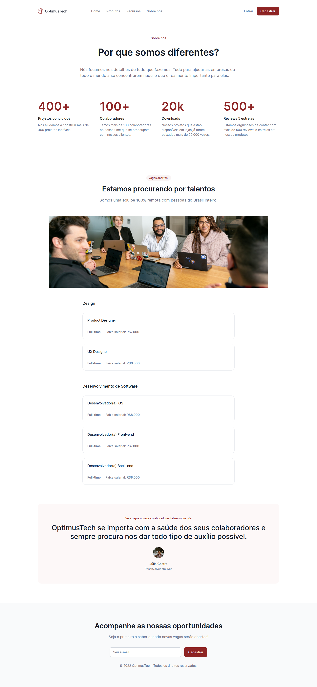

# 7daysOfCode-HTML-CSS-Alura

Challenge para praticar HTML e CSS

| :placard: Vitrine.Dev |                                                                                                  |
| --------------------- | ------------------------------------------------------------------------------------------------ |
| :sparkles: Nome       | **7daysOfCode-HTML-CSS-Alura**                                                                   |
| :label: Tecnologias   | html, css, scss (tecnologias utilizadas)                                                         |
| :rocket: URL          | [https://url-deploy.com.br](https://7days-of-code-html-css-alura-ac1vpefbj-rubendvb.vercel.app/) |
| :fire: Desafio        | [https://url-do-desafio.com.br](https://github.com/giovannamoeller/7daysofcode-html-css)         |

<!-- Inserir imagem com a #vitrinedev ao final do link -->

